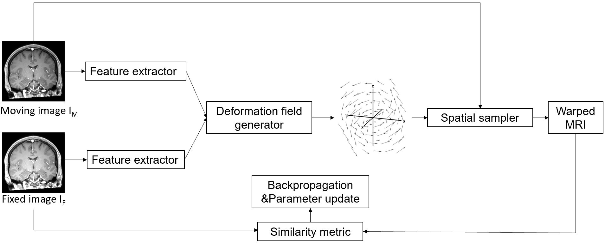

# RegNet
Deformable Cross-modality MRI Registration Using 3D CNN

## Introduction
This repository presents a framework that can perform non-rigid cross-modality MRI registration using 3D convolutional neural network (CNN). The framework is composed of three components: feature extractor, deformation field generator and spatial sampler. Our automatic registration framework adopts unsupervised learning approach, allows accurate end-to-end deformable cross-modality MRI registration.
## Prerequesites
- Python3
- Numpy
- Tensorflow
- nibabel
## Usage
- train.py: Train the network
- deploy.py: Test and deploy the model
- model.py: The main model
- data.py: Data loading, normalization and augmentation
- ops.py: Utilities
- config.py: Configuration
